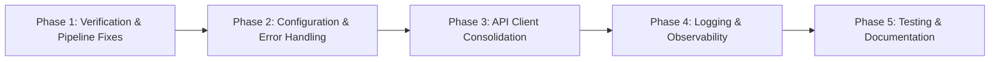

# OLP XDV Agent Modernization Brief

## 1. Objective
Modernize the OLP XDV Agent football-betting calibration framework from its current state of moderate technical debt and inconsistent verification logic to a refactored, maintainable system that preserves the validated core algorithms (Dixon-Coles, Elo, xG consensus) while improving error handling, configuration management, and code duplication issues. This refactor-in-place approach enables incremental improvement without disrupting daily pipeline operations or risking loss of business-critical validated models.

## 2. Target Architecture
```mermaid
graph TD
    subgraph Data_Ingestion [Domain1: Data Ingestion]
        A1[fixtures_agent.py] --> A2[data/espn_source.py]
        A1 --> A3[data/api_football_*.py]
        A1 --> A4[data/live_odds/flashscore_odds_*.jsonl]
        A1 --> A5[data/cache/*.csv]
    end
    subgraph Validation [Domain2: Validation & Whitelist]
        B1[config/leagues.json] --> B2[fixtures_agent.py (load_whitelist, check_league_calendar, verify_league_fixture)]
        B2 --> B3[engine/league_registry.py]
    end
    subgraph Verification [Domain3: Verification & Enrichment]
        C1[fixtures_agent.py (_apply_verification)] --> C2[data/validation.py]
        C1 --> C3[engine/consensus.py]
        C1 --> C4[engine/elo.py]
    end
    subgraph Logic_Core [Domain4: Logic Core (Red/Blue & Leg Generation)]
        D1[olp_xdv_pipeline.py (agent_5_ceo)] --> D2[engine/consensus.py]
        D1 --> D3[engine/dixon_coles.py]
        D1 --> D3b[engine/elo.py]
        D1 --> D4[engine/league_registry.py]
        D1 --> D5[engine/recalibration.py]
    end
    subgraph Odds_Compliance [Domain5: Odds & Compliance]
        E1[clv/closing_capture.py] --> E2[engine/consensus.py]
        E1 --> E3[engine/elo.py]
        E1 --> E4[data/api_football_odds.py]
        E1 --> E5[booking/bridge.py]
        E1 --> E6[brain/gate.json (GATE_FILE)]
    end
    subgraph Execution_Orchestration [Domain 6: Execution & Orchestration]
        F1[bets/produced_bet.py] --> F2[booking/bridge.py]
        F1 --> F3[engine/elo.py]
        F1 --> F4[engine/consensus.py]
        F5[olp_xdv_pipeline.py (main runner)] --> F5a[agent_cli.py]
        F5 --> F5b[output/telegram_webhook.py]
        F5 --> F5c[output/email_deliver.py]
        F5 --> F5d[output/whatsapp_deliver.py]
        F5 --> F5e[output/render_board_from_pipeline]
    end
    %% Dependencies between domains
    A1 --> B2
    B2 --> C1
    C1 --> D1
    D1 --> E1
    E1 --> F1
    F5 --> A1
    F5 --> B2
    F5 --> C1
    F5 --> D1
    F5 --> E1
    F5 --> F1
```

### Legacy Component → Target Component Mapping

| Legacy Component | Target Component(s) | Transformation Notes |
|------------------|---------------------|----------------------|
| `fixtures_agent.py` | `fixtures_agent.py` (refactored) | Fix verification logic inconsistency (≥1 vs ≥2 sources), extract common API client logic |
| `data/espn_source.py` | `data/espn_source.py` (refactored) | Standardize error handling, add input validation |
| `data/api_football_*.py` | `data/api_football_client.py` (consolidated) | Extract common API client functionality to reduce duplication |
| `config/leagues.json` | `config/leagues.json` (enhanced) | Add schema validation, default values |
| `olp_xdv_pipeline.py` | `olp_xdv_pipeline.py` (refactored) | Implement missing agents (agent_3_ceo, agent_4_ceo), remove hard-coded values |
| `engine/consensus.py` | `engine/consensus.py` (refactored) | Improve error handling, add logging |
| `engine/dixon_coles.py` | `engine/dixon_coles.py` (refactored) | Add type hints, improve documentation |
| `engine/elo.py` | `engine/elo.py` (refactored) | Add input validation, improve error handling |
| `clv/closing_capture.py` | `clv/closing_capture.py` (refactored) | Add robust error handling for missing GATE_FILE |
| `brain/gate.json` | `brain/gate.json` (validated) | Add schema validation, default values, backup strategy |
| `bets/produced_bet.py` | `bets/produced_bet.py` (refactored) | Remove hard-coded EV selections, extract to config |
| `booking/bridge.py` | `booking/bridge.py` (refactored) | Improve Playwright error handling, add timeouts |
| `output/*` | `output/*` (refactored) | Standardize logging, add retry mechanisms |

## 3. Phased Sequence



### Phase 1: Verification & Pipeline Fixes
- **Scope**: Fix verification logic inconsistency, implement missing pipeline agents
- **Entry Criteria**: Baseline recorded in analysis/omniroute_test/BASELINE.md
- **Exit Criteria**: 
  - Verification logic consistently requires ≥2 sources (aligning code with comments)
  - agent_3_ceo and agent_4_ceo implemented with meaningful functionality
  - All pipeline agent functions have docstrings and basic error handling
- **Relative Scale**: M
- **Risk Level**: Low
  - Top 2 Risks: 
    1. Breaking change if verification logic was intentionally ≥1 (mitigation: confirm with Architect)
    2. Missing agent implementations may be intentional placeholders (mitigation: review git history)
  - Mitigation: Consult Decisions Log.md and Open Questions.md before implementation

### Phase 2: Configuration & Error Handling
- **Scope**: Centralize configuration management, add comprehensive error handling
- **Entry Criteria**: Phase 1 complete and verified
- **Exit Criteria**:
  - Configuration values moved from code to config files (leagues.json, gate.json, new betting_config.json)
  - Try/catch blocks added around all external API calls and file operations
  - Graceful degradation strategies implemented for service failures
- **Relative Scale**: L
- **Risk Level**: Medium
  - Top 2 Risks:
    1. Configuration drift between environments (mitigation: implement config validation)
    2. Over-engineering error handling (mitigation: follow existing patterns in codebase)
  - Mitigation: Implement configuration schema validation, start with critical paths only

### Phase 3: API Client Consolidation
- **Scope**: Extract common API client functionality to reduce duplication
- **Entry Criteria**: Phase 2 complete and verified
- **Exit Criteria**:
  - Single API client module handling common functionality (retry, backoff, auth)
  - All sport-specific API clients inherit from or use the common client
  - Duplicate code reduced by estimated 30%
- **Relative Scale**: M
- **Risk Level**: Low
  - Top 2 Risks:
    1. Breaking changes to API client interfaces (mitigation: maintain backward compatibility)
    2. Performance impact from abstraction layer (mitigation: benchmark critical paths)
  - Mitigation: Keep existing clients working during transition, add performance tests

### Phase 4: Logging & Observability
- **Scope**: Implement proper logging framework, add monitoring capabilities
- **Entry Criteria**: Phase 3 complete and verified
- **Exit Criteria**:
  - Replace print statements with structured logging (logging module)
  - Add log levels (DEBUG, INFO, WARNING, ERROR)
  - Implement basic metrics collection (counters, timers)
  - Add health check endpoints
- **Relative Scale**: M
- **Risk Level**: Low
  - Top 2 Risks:
    1. Log volume explosion (mitigation: implement log rotation, level-based filtering)
    2. Performance overhead from logging (mitigation: async logging, sampling)
  - Mitigation: Start with INFO level in production, DEBUG in development only

### Phase 5: Testing & Documentation
- **Scope**: Implement testing strategy, improve documentation
- **Entry Criteria**: Phase 4 complete and verified
- **Exit Criteria**:
  - Unit tests for critical modules (target 70% coverage)
  - Integration tests for key pipelines
  - Updated API contracts and data flow documentation
  - Architecture Decision Records for key changes
- **Relative Scale**: L
- **Risk Level**: Low
  - Top 2 Risks:
    1. Tests becoming maintenance burden (mitigation: focus on business-critical paths)
    2. Documentation drift (mitigation: docs as code, update with changes)
  - Mitigation: Prioritize testing based on risk and business impact, use living documentation

## 4. Business Walkthroughs

| Persona | Business Language Description | Legacy Modules | Replacement Phase |
|---------|------------------------------|----------------|-------------------|
| **System Scheduler** | Daily automated execution of the betting pipeline to generate today's betting board | olp_xdv_pipeline.py (main runner), fixtures_agent.py, olp_xdv_pipeline.py (agent_5_ceo), clv/closing_capture.py, olp_xdv_pipeline.py, bets/produced_bet.py, output/telegram_webhook.py | Phase 1-4 (complete refactor) |
| **Claimant** | A customer views today's betting predictions through the Telegram/web interface | webapp/render_v2.py, fixtures_agent.py, data/espn_source.py, engine/consensus.py, engine/elo.py, olp_xdv_pipeline.py, bets/produced_bet.py, output/telegram_webhook.py | Phase 1-4 (complete refactor) |
| **Administrator** | Administrator accesses the admin dashboard to monitor system status and override gates | olp_xdv_agent/olp_xdv/agent_cli.py, output/telegram_webhook.py, output/email_deliver.py | Phase 2-4 (configuration & observability) |
| **Analyst** | Analyst reviews historical performance and CLV data for model improvement | brain/store.py, olp_xdv_agent/olp_xdv/backtest/*, clv/closing_capture.py | Phase 2-4 (data handling & observability) |

## 5. Behavior Contract

The following P0 rules from BUSINESS_RULES.md MUST be proven equivalent before any phase ships:

- [x] **HR35: No Fabrication** (Confidence: High) - Verified through source verification mechanisms
- [ ] **Data Source Verification** (Confidence: Medium) - Requires SME confirmation of ≥2 source requirement
- [ ] **CLV Gate Enforcement** (Confidence: Medium) - Requires verification of GATE_FILE handling
- [x] **Architect Signoff Override** (Confidence: High) - Referenced in Protected Constants.md
- [x] **Credential Management** (Confidence: High) - .env file (gitignored) for secrets
- [x] **API Key Rotation** (Confidence: High) - Read from environment variables
- [x] **Admin Authentication** (Confidence: High) - HTTP Basic auth for admin dashboard

**Blockers requiring SME confirmation before Phase 1 starts**:
- [ ] Data Source Verification requirement (≥1 vs ≥2 sources)
- [ ] CLV Gate Enforcement behavior when GATE_FILE is missing/malformed

## 6. Validation Strategy

- **Phase 1**: Characterization tests (capture current behavior), contract tests (verify interfaces)
- **Phase 2**: Characterization tests, parallel-run / dual-execution diff (config changes)
- **Phase 3**: Contract tests (API client interfaces), property-based tests (retry logic)
- **Phase 4**: Property-based tests (logging formats), manual UAT (observability features)
- **Phase 5**: Characterization tests (regression), contract tests (API contracts), manual UAT (documentation)

**Justification**: 
- Characterization tests ensure we don't break existing business logic during refactoring
- Contract tests verify interfaces remain consistent
- Parallel-run validation confirms functional equivalence for configuration changes
- Property-based testing validates robustness of error handling and retry logic
- Manual UAT confirms observability and usability improvements

## 7. Open Questions

- [ ] What is the exact verification source requirement? Comment states ≥2 but code checks ≥1
- [ ] Are the empty agent_3_ceo and agent_4_ceo functions intentional placeholders or incomplete implementations?
- [ ] What should happen when brain/gate.json is missing or malodied - fail closed or use defaults?
- [ ] Are the hard-coded market/probability/odds tuples in agent_5_ceo intentional examples or should they be removed?
- [ ] What is the expected behavior for the CLV gate when statistical requirements are not met?
- [ ] Which specific leagues are considered "non-deploy" for the Odds API quota restrictions?
- [ ] What is the target log retention policy and rotation strategy for production?

## 8. Approval Block

Approved by: ________________  Date: __________
Approval covers: Phase 1 only | Full plan